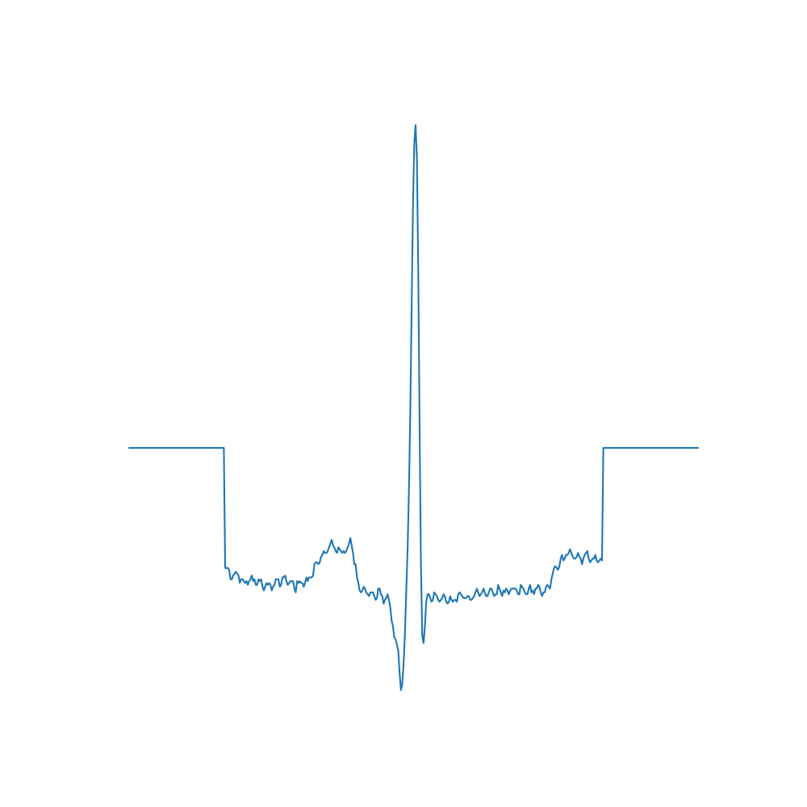

# Arrhythmia detection based on ECG Signal by Image using 2D Deep CNN
- 2D Image 참고 논문 : [A Hybrid Deep CNN Model for Abnormal Arrhythmia Detection Based on Cardiac ECG Signal](https://www.mdpi.com/1424-8220/21/3/951)

ECG 데이터를 그래프로 변환하여 2D CNN에 심전도를 구별하는 모델이다. 해당 모델은 위 논문에서 2D CNN 의 모델 구조를 참고하였다. 논문에서 입력되는 데이터와 실제 데이터가 차이가 존재하여 이를 명확히 따라하지는 않는다. 어디까지나 __참고__ 일 뿐. 

# Data
그래프로 변환한 이미지 데이터가 2GB가 넘어 LFS을 통해서도 업로드가 어렵다. 코드와 원본 데이터를 올려두었으니 *cutting_graph.py* 파일을 사용하면 파일을 구할 수 있다. 그 과정이 너무 오래걸린다 싶으면 아래 링크를 통해서 다운로드를 받을 수 있다.
- [Graph Input data - Google drive Link](https://drive.google.com/file/d/1DjuzXjQ21p3Bhuky8ojlvzzRiAnffzvP/view?usp=sharing)

Input data의 예시를 하나 보여주면 아래와 같은 이미지가 들어가게 된다.

이미지 크기가 좀 크긴하다만 어차피 모델에 들어가기 이전에 조정을 하고 들어간다. 256 * 256 사이즈로 입력값으로 들어가게 된다. 기존에는 plot title 을 실수로 추가를 해버려서 불필요한 데이터가 들어갔다만 그 부분도 수정하여 이제는 그래프만 저장 되도록 수정하였다. 위 사진은 Normal 비트 예시 일 뿐, 모든 비트가 저리 이쁘진 않다... ~~사실 노이즈도 있어서 그렇게 이쁘다고는 못하지만 그래도 곱게 봐달라.~~ 

## Model 구성

차이가 있다면 끝단에서 출력하는 나오는 Class의 개수가 다르다. 우리는 5개 (N, S, V, F, Q) 를 갖고 했으나 해당 논문에서는 8개로 분류를 진행하였다. 
